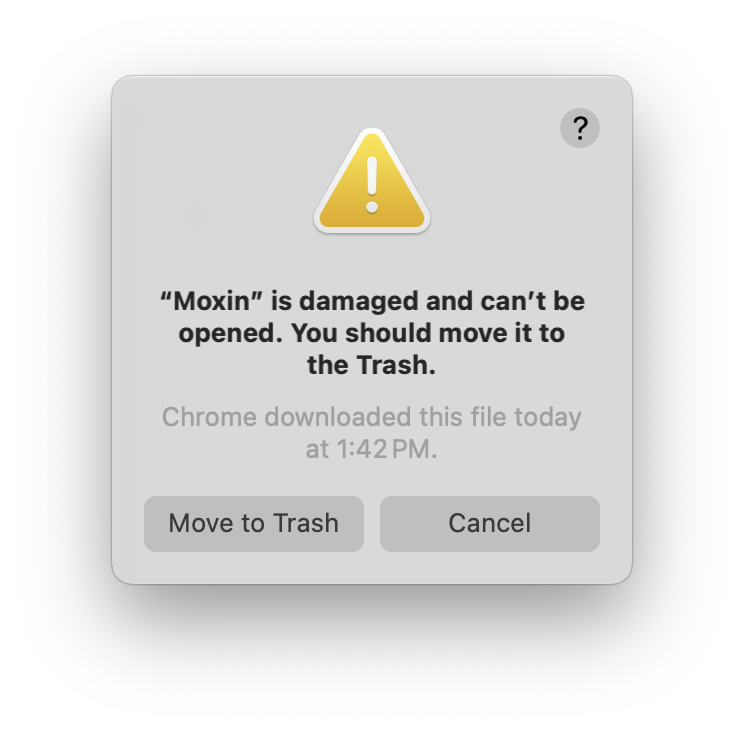

# Moxin: a Rust AI LLM client built atop [Robius](https://github.com/project-robius)

Moxin is an AI LLM client written in Rust to demonstrate the functionality of the Robius, a framework for multi-platform application development in Rust.

> ⚠️ Moxin is just getting started and is not yet fully functional.

The following table shows which host systems can currently be used to build Moxin for which target platforms.
| Host OS | Target Platform | Builds? | Runs? |
| ------- | --------------- | ------- | ----- |
| macOS   | macOS           | ✅      | ✅    |  
| Linux   | ubuntu(x86_64-unknown-linux-gnu) | ✅ | ? |

## Building and Running

First, [install Rust](https://www.rust-lang.org/tools/install).

Then, install the required WasmEdge WASM runtime:

```sh
curl -sSf https://raw.githubusercontent.com/WasmEdge/WasmEdge/master/utils/install_v2.sh | bash

source $HOME/.wasmedge/env
```

Obtain the source code from this repository:
```sh
git clone https://github.com/moxin-org/moxin.git
```

### macOS

Then, on a standard desktop platform (macOS), simply run:

```sh
cd moxin
cargo run
```

### Linux

To build Moxin on Linux, you must install the following dependencies:
`openssl`, `clang`/`libclang`, `binfmt`, `Xcursor`/`X11`, `asound`/`pulse`.

On a Debian-like Linux distro (e.g., Ubuntu), run the following:
```sh
sudo apt-get update
sudo apt-get install libssl-dev pkg-config llvm clang libclang-dev binfmt-support libxcursor-dev libx11-dev libasound2-dev libpulse-dev
```

Then, run:

```sh
cd moxin
cargo run
```


## Packaging Moxin for Distribution

Install cargo packager:
```sh
cargo install --locked cargo-packager
```
For the sake of posterity, these instructions were tested with cargo-packager v0.9.0.


### Packaging for Linux
On a Debian-based Linux distribution (e.g., Ubuntu), you can generate a `.deb` Debian package, an AppImage, and a pacman installation package.

> Only the `.deb` file has been tested so far.

To install the Moxin app from the `.deb`package on a Debian-based Linux distribution (e.g., Ubuntu), run:
```sh
cd dist/
sudo dpkg -i moxin-runner_0.1.0_amd64.deb  ## requires entering your password
```


### Packaging for macOS
This can only be run on an actual macOS machine, due to platform restrictions.

Ensure you are in the root `moxin` directory, and then you can use `cargo packager` to generate an `.app` bundle and a `.dmg` disk image:
```sh
cargo packager --release --verbose   ## --verbose is optional
```

> [!TIP]
> You will see a .dmg window pop up — please leave it alone, it will auto-close once the packaging procedure has completed.

If you receive the following error:
```
ERROR cargo_packager::cli: Error running create-dmg script: File exists (os error 17)
```
then open Finder and unmount any Moxin-related disk images, then try the above `cargo packager` command again.

After the command completes, you should see both the `Moxin.app` and the `.dmg` in the `dist/` directory.
You can immediately double-click the `Moxin.app` bundle to run it, or you can double-click the `.dmg` file to 

> Note that the `.dmg` is what should be distributed for installation on other machines, not the `.app`.

If you'd like to modify the .dmg background, here is the [Google Drawings file used to generate the MacOS .dmg background image](https://docs.google.com/drawings/d/1Uq13nAsCKFrl4s16HeLqpVfQ-vbF7v2Z8HFyqgeyrbE/edit?usp=sharing).

### Installing and running the packaged macOS app
> [!IMPORTANT]
> The Moxin application package on macOS is currently not signed, so Apple will display a warning on macOS (shown below) when you first attempt to open it after installation.
>
> **This warning is not true**. The app is not damaged, it just hasn't been signed.



To get around this, do the following:
* Install the Moxin app as normal by opening the `.dmg` and dragging the Moxin app to the Applications folder shortcut.
* Open the Moxin app from your Applications folder.
* An error message will pop up, as described above. **Click cancel**.
* Open a terminal and run the following command:
  ```sh
  xattr -dr com.apple.quarantine path/to/the/installed/Moxin.app
  ```
  * The path is typically `/Applications/Moxin.app`, assuming you dragged the app icon into the Applications folder.
* Now open the Moxin app again as normal, it should work as expected.
