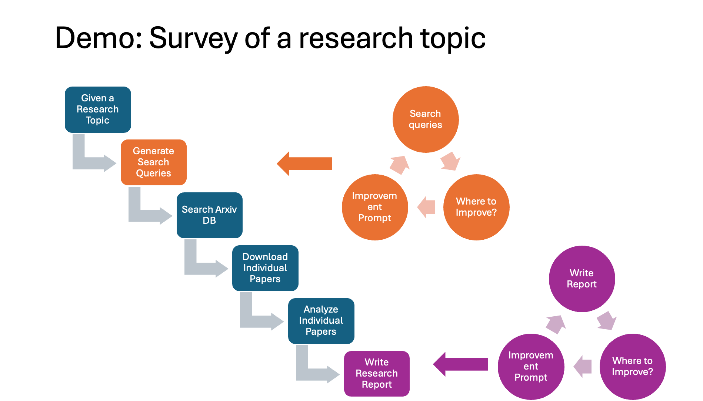

# Paper Super Agent  Example
**任务目标:**
- 根据用户的需求,到arxiv上搜索相关论文,然后根据论文的标题.下载对应的论文,然后根据用户的问题和论文的内容,总结出一个最好的任务解决方案

# 1, 流程说明:
1. [keyword_extractor](use_case%2Fkeyword_extractor.yml)  用于从用户任务中提取相关关键字，以优化 arXiv 上的学术论文搜索。根据用户需求，提供不超过三组关键词检索相关论文
2. [paper_downloader_agent](use_case%2Fpaper_downloader_agent.yml)   根据关键词,去arxiv上搜索相关论文,然后根据论文的标题.下载对应的论文
3. [paper_analyze_agent](use_case%2Fpaper_analyze_agent.yml)  将下载好的每一个论文都使用Rag的方式上传到VectorStore,提取出其中的关键信息,然后生成每一个论文总结.
4. [report_writer_agent](use_case%2Freport_writer_agent.yml)  将问题结合论文总结,生成一个报告
5. [feedback_agent](use_case%2Ffeedback_agent.yml) 根据问题->答案,给出一些建议
6. [refinement_agent](use_case%2Frefinement_agent.yml)  根据建议/问题/答案/论文总结,生成一个更好的答案
7. [evaluation_agent](use_case%2Fevaluation_agent.yml)  根据问题和答案,评估答案是否满足需求,如果满足需求,返回答案,如果不满足需求,检查迭代次数,如果迭代次数达到阈值,返回答案,否则,调用feedback_agent再次给出建议

## 启动

**如果你需要运行这个案例，请先安装mae，然后运行下面的命令**：
~~~
dora up && dora start  paper_dataflow.yml  --attach   
python3 task_input.py   
~~~

**如果你需要对配置进行修改,请查看[README_zh.md](..%2F..%2F..%2Fdocs%2FREADME_zh.md)**

**语言**: 
- [English](README.md)

## 2, 问题结果对比 ([log_report_writer_agent.txt](out%2F0190c362-d212-7ffa-83ee-b353ff7cc71e%2Flog_report_writer_agent.txt))

### Question: How to design an AIOS?

### Answer:

Designing an AI Operating System (AIOS) involves several key strategies and methodologies, as identified through the analysis of various academic papers. Here are the main approaches and ideas proposed by researchers:

1. **Modular Architecture**:
   - **Component-Based Design**: Implement a modular architecture where different components (e.g., data processing, model training, inference) are decoupled. This allows for flexibility and scalability in the system [2304.01597v1].
   - **Microservices**: Use microservices to manage different functionalities independently, enabling easier updates and maintenance [2304.01597v1].

2. **Integration of Advanced AI Techniques**:
   - **Knowledge Graphs**: Integrate knowledge graphs to enhance the system's ability to understand and process complex queries by providing contextual information [2304.01597v1].
   - **Self-Supervised Learning**: Employ self-supervised learning techniques to improve the system's ability to learn from large amounts of unlabeled data, enhancing its language understanding and generation capabilities [2304.01597v1].

3. **User-Centric Design**:
   - **Natural Language Interface**: Develop a natural language interface that allows users to interact with the AIOS using conversational language, making it more accessible and user-friendly [2304.01597v1].
   - **Personalization**: Implement personalization features that adapt to individual user preferences and behaviors, providing a more tailored experience [2304.01597v1].

4. **Security and Privacy**:
   - **Data Encryption**: Ensure that all user data is encrypted both in transit and at rest to protect against unauthorized access [2304.01597v1].
   - **Privacy-Preserving Techniques**: Use techniques such as differential privacy to ensure that the system can learn from user data without compromising individual privacy [2304.01597v1].

5. **Scalability and Performance**:
   - **Distributed Computing**: Utilize distributed computing frameworks to handle large-scale data processing and model training, ensuring that the system can scale efficiently [2304.01597v1].
   - **Optimization Algorithms**: Implement optimization algorithms to improve the performance and efficiency of the AI models, reducing latency and resource consumption [2304.01597v1].

6. **Continuous Learning and Adaptation**:
   - **Online Learning**: Incorporate online learning mechanisms that allow the system to continuously learn and adapt from new data, ensuring that it remains up-to-date with the latest information [2304.01597v1].
   - **Feedback Loops**: Establish feedback loops where user interactions and feedback are used to refine and improve the system over time [2304.01597v1].

By integrating these strategies, an AIOS can be designed to be flexible, scalable, user-friendly, and secure, while continuously improving its capabilities through advanced AI techniques and user feedback.

### 问题：如何设计AI操作系统（AIOS）？

### 回答：

设计AI操作系统（AIOS）涉及到几个关键策略和方法，以下是通过分析各种学术论文总结出的主要方法和理念：

1. **模块化架构**：
   - **基于组件的设计**：实现模块化架构，将数据处理、模型训练、推理等不同组件解耦。这为系统提供了灵活性和可扩展性 [2304.01597v1]。
   - **微服务**：使用微服务独立管理不同功能，便于更新和维护 [2304.01597v1]。

2. **整合先进的AI技术**：
   - **知识图谱**：整合知识图谱，以增强系统理解和处理复杂查询的能力，通过提供上下文信息来实现 [2304.01597v1]。
   - **自监督学习**：采用自监督学习技术，提升系统从大量未标注数据中学习的能力，增强其语言理解和生成能力 [2304.01597v1]。

3. **以用户为中心的设计**：
   - **自然语言界面**：开发自然语言界面，让用户可以通过对话语言与AIOS进行交互，提高可访问性和用户友好性 [2304.01597v1]。
   - **个性化**：实施个性化功能，适应每个用户的偏好和行为，提供更加定制化的体验 [2304.01597v1]。

4. **安全和隐私**：
   - **数据加密**：确保所有用户数据在传输和存储时都经过加密，防止未经授权的访问 [2304.01597v1]。
   - **隐私保护技术**：使用差分隐私等技术，确保系统在从用户数据中学习的同时，不会侵犯个人隐私 [2304.01597v1]。

5. **可扩展性和性能**：
   - **分布式计算**：利用分布式计算框架处理大规模数据处理和模型训练，确保系统能够有效扩展 [2304.01597v1]。
   - **优化算法**：实施优化算法，提高AI模型的性能和效率，减少延迟和资源消耗 [2304.01597v1]。

6. **持续学习和适应**：
   - **在线学习**：整合在线学习机制，让系统能够持续从新数据中学习和适应，确保其与最新信息保持同步 [2304.01597v1]。
   - **反馈回路**：建立反馈回路，利用用户交互和反馈来不断优化和改进系统 [2304.01597v1]。

通过整合这些策略，可以设计出一个灵活、可扩展、用户友好和安全的AIOS，并通过先进的AI技术和用户反馈不断提升其能力。

## 3, 问题结果对比 ([log_refinement_agent.txt](out%2F0190be58-99ab-77ed-ad62-33d7e897e591%2Flog_refinement_agent.txt))
**Answer:**

Designing an AIOS (Artificial Intelligence Operating System) involves several critical steps to ensure it is functional, efficient, and user-friendly. Below is a detailed guide on how to design an AIOS, incorporating the suggestions provided:

### Step-by-Step Instructions on Designing an AIOS

1. **Define the Objectives and Scope**
   - **Objective**: Clearly outline what the AIOS aims to achieve. Is it for general-purpose use, specific industry applications, or research?
   - **Scope**: Determine the functionalities and limitations. This includes deciding on the types of AI models it will support, the hardware requirements, and the user base.

2. **Research and Analysis**
   - **Current Trends**: Study existing AIOS solutions and identify their strengths and weaknesses. Look into current trends in AI and operating systems to ensure your design is up-to-date.
   - **User Feedback**: Gather feedback from potential users to understand their needs and preferences. This can be done through surveys, interviews, or focus groups.

3. **Architecture Design**
   - **Modular Design**: Create a modular architecture that allows for easy updates and scalability. This includes defining core modules such as the kernel, AI engine, user interface, and security.
   - **Integration**: Ensure seamless integration with existing hardware and software. This might involve developing APIs and ensuring compatibility with popular AI frameworks like TensorFlow, PyTorch, etc.

4. **Development of Core Components**
   - **Kernel**: Develop a robust kernel that can handle AI-specific tasks efficiently. This includes managing resources, scheduling tasks, and ensuring security.
   - **AI Engine**: Design an AI engine capable of running various AI models. This should include support for training, inference, and model management.
   - **User Interface**: Create an intuitive user interface that allows users to interact with the AIOS easily. This could be a graphical interface, command-line interface, or both.

5. **Implementation and Testing**
   - **Prototyping**: Develop a prototype to test the core functionalities. This helps in identifying any issues early in the development process.
   - **Testing**: Conduct extensive testing, including unit tests, integration tests, and user acceptance tests. Ensure the AIOS performs well under different scenarios and workloads.

6. **Deployment and Maintenance**
   - **Deployment**: Plan the deployment process carefully. This includes preparing documentation, training users, and setting up support channels.
   - **Maintenance**: Establish a maintenance plan to handle updates, bug fixes, and user support. Regularly update the AIOS to incorporate new features and improvements.

### Examples and Case Studies

- **Example 1**: Google's Android AIOS, which integrates AI capabilities directly into the operating system to enhance user experience through features like Google Assistant and predictive text.
- **Example 2**: IBM's Watson AIOS, designed for enterprise applications, providing tools for data analysis, natural language processing, and machine learning.

### Relevance to Current AIOS Design Trends

- **Edge Computing**: Incorporating edge computing capabilities to process data locally on devices, reducing latency and improving performance.
- **Security**: Emphasizing security features to protect user data and ensure compliance with regulations.
- **User-Centric Design**: Focusing on user experience by providing customizable interfaces and easy-to-use tools.

### Enhancing Clarity with Visuals

- **Flowcharts**: Use flowcharts to illustrate the architecture and workflow of the AIOS.
- **Diagrams**: Include diagrams to show the integration of different components and how they interact with each other.

### Considering User Feedback

- **Iterative Design**: Adopt an iterative design approach, where user feedback is continuously incorporated into the development process.
- **Beta Testing**: Conduct beta testing with a group of users to gather feedback and make necessary adjustments before the final release.

By following these steps and incorporating the suggestions, you can design an AIOS that is efficient, user-friendly, and aligned with current trends in AI and operating systems.

**回答：**

设计AI操作系统（AIOS）涉及几个关键步骤，以确保其功能完善、高效且用户友好。以下是设计AIOS的详细指南，结合了所提供的建议：

### 设计AIOS的逐步说明

1. **确定目标和范围**
   - **目标**：明确AIOS的目标。是用于通用用途、特定行业应用还是研究？
   - **范围**：确定功能和限制。这包括决定支持的AI模型类型、硬件需求和用户群体。

2. **研究与分析**
   - **当前趋势**：研究现有的AIOS解决方案，找出它们的优点和缺点。研究当前AI和操作系统的趋势，确保设计符合最新发展。
   - **用户反馈**：收集潜在用户的反馈，了解他们的需求和偏好。可以通过调查、访谈或焦点小组进行。

3. **架构设计**
   - **模块化设计**：创建一个模块化架构，便于更新和扩展。这包括定义核心模块，如内核、AI引擎、用户界面和安全。
   - **集成**：确保与现有硬件和软件的无缝集成。这可能需要开发API并确保与TensorFlow、PyTorch等流行AI框架的兼容性。

4. **核心组件的开发**
   - **内核**：开发一个能够高效处理AI特定任务的坚固内核，包括资源管理、任务调度和安全保证。
   - **AI引擎**：设计一个能够运行各种AI模型的AI引擎，包括支持训练、推理和模型管理。
   - **用户界面**：创建一个直观的用户界面，使用户能够轻松与AIOS交互。可以是图形界面、命令行界面或两者兼有。

5. **实施与测试**
   - **原型开发**：开发一个原型来测试核心功能，有助于在开发过程中早期发现问题。
   - **测试**：进行广泛的测试，包括单元测试、集成测试和用户接受测试。确保AIOS在不同场景和工作负载下表现良好。

6. **部署与维护**
   - **部署**：仔细计划部署过程，包括准备文档、培训用户和建立支持渠道。
   - **维护**：建立维护计划，处理更新、错误修复和用户支持。定期更新AIOS，以加入新功能和改进。

### 示例和案例研究

- **示例1**：谷歌的Android AIOS，将AI能力直接集成到操作系统中，通过Google Assistant和预测文本等功能增强用户体验。
- **示例2**：IBM的Watson AIOS，为企业应用设计，提供数据分析、自然语言处理和机器学习工具。

### 设计趋势的相关性

- **边缘计算**：集成边缘计算功能，在设备上本地处理数据，降低延迟并提高性能。
- **安全**：强调安全功能，保护用户数据并确保符合法规。
- **以用户为中心的设计**：关注用户体验，提供可定制的界面和易用工具。

### 增强清晰度的可视化

- **流程图**：使用流程图来说明AIOS的架构和工作流程。
- **图表**：包含图表，展示不同组件的集成及其相互作用。

### 考虑用户反馈

- **迭代设计**：采用迭代设计方法，不断将用户反馈纳入开发过程。
- **测试版测试**：与一组用户进行测试版测试，收集反馈并在最终发布前做出必要的调整。

通过遵循这些步骤并结合建议，您可以设计出一个高效、用户友好并符合当前AI和操作系统趋势的AIOS。
